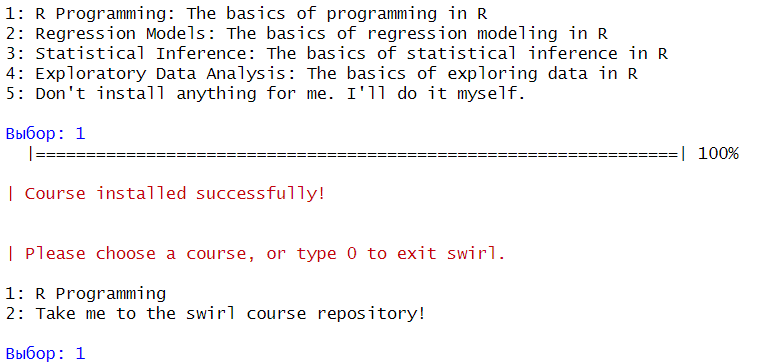
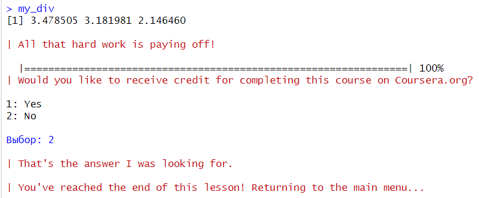
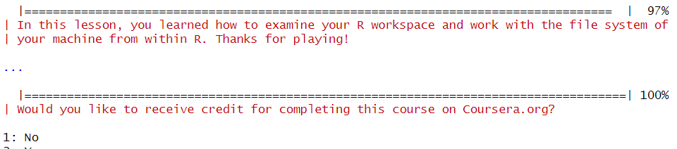
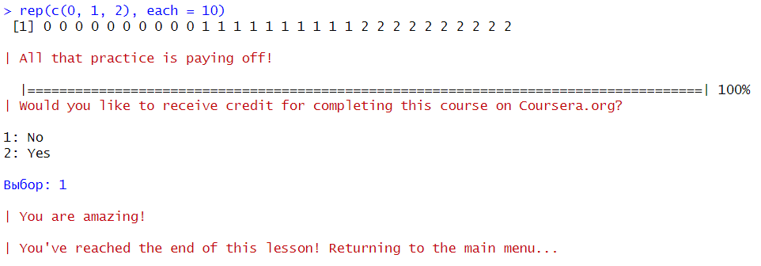
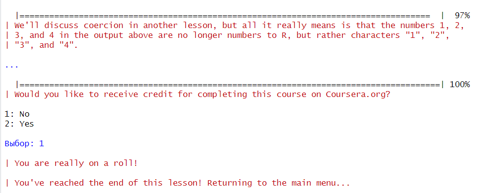
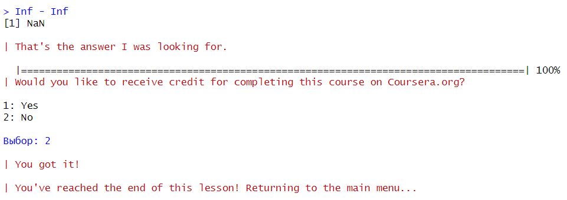

# Практическая работа №1
Arch

# Подготовка воспроизводимых отчетов

## Цель работы

1.  Развить практические навыки использования языка программирования R
    для обработки данных
2.  Развить навыки работы в Rstudio IDE:

-   установка пакетов
-   работа с проектами в Rstudio
-   настройка и работа с Git

1.  Закрепить знания базовых типов данных языка R и простейших операций
    с ними

## ️Исходные данные

1.  R 4.4.1;
2.  RStudio 2024.04.2+764;

## Решение задач

### 3. Установить программный пакет *swirl* с помощью:

-   интерфейса RStudio IDE
-   функцией R:

``` r
install.packages("swirl")
```

### 4. Запустить задание с помощью

    ``` r
    swirl::swirl()
    ```

### 5. Выбрать из меню курсов `1. R Programming: The basics of programming in R`



### 6. Прохождение подкурсов

-   Basic Building Blocks

    

-   Workspace and Files

    

-   Sequences of Numbers

    

-   Vectors

    

-   Missing Values

    

## ️Вывод

В результате выполнения работы были освоены базовые знания языка R, а
также его аспекты:

-   базовые структурные блоки (Basic Building Blocks)
-   рабочие пространства и файлы (Workspace and Files)
-   последовательности чисел (Sequences of Numbers)
-   векторы (Vectors)
-   пропущенные значения (Missing Values)
